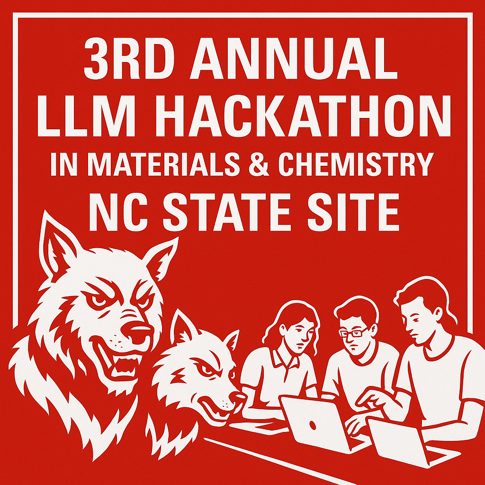

<h1 align="center"> LLM Hackathon for Applications in Materials Science & Chemistry @ NC State</h1>

  

  
  
  
  

---

## Overview

NC State is hosting an [on-site hub](https://ncsu-llm-hackathon-materials-2025.github.io/ncsu-llm-hackathon-materials.github.io/) for the 3rd hybrid [international LLM Hackathon](https://llmhackathon.github.io/) for Applications in Materials and Chemistry, happening September 11–12, 2025.
This is a **2-day build sprint** to prototype research and teaching tools powered by large language models for discovery, simulation workflows, data curation, and scientific communication in **materials science and chemistry**. [Register now](https://docs.google.com/forms/d/e/1FAIpQLSdhADJ6hzT-uZguO0JITpIpb1NrM0HYbh_ROxykZ5wkBdgzWg/viewform)!
- **Team size:** 3-7 (you can sign up with a group or by yourself and be assigned to a group)
- **Prizes:** Awards for top teams  
- **Mentors:** Industry & faculty  
- **Workshops:** Beginner-friendly  
- **Lunch and snacks provided** for on-site participants  

---

## Local Sponsors

NC State College of Engineering (add links)
AI and Data Science Academy
ed

---

## Tracks & Ideas
- LLM copilots for **materials databases** and ELNs  
- Workflow agents for **MD/DFT** setup, execution, and analysis  
- Design tools for **polymers, soft & biomaterials**  
- Education & outreach: interactive labs, grading aides  
- Open science: dataset curation, metadata extraction  

---

## Judging Criteria
- **Impact:** addresses a real research/education need  
- **Originality:** novel approach or integration  
- **Technical depth:** sound methods & evaluation  
- **Presentation:** clarity, demo quality, documentation  

---

## Hackathon Schedule
**10:00 AM (EST), Sept 11**  
*Hackathon Kick-off*  
Kick-off (virtual video – link coming soon) and opening teaming event  

**11:00 AM (EST), Sept 11**  
*Hacking Begins*  
Mentorship sessions available  

**6:00 PM (EST), Sept 12**  
*Final Submissions*  
Project submission deadline  

**~Sept 15 (time ASAP, EST)**  
*Post-Event Showcase*  
Winners announced, featured projects invited to virtual showcase 

---

## Location
**NC State — Centennial Campus**  
📍 Exact location TBD 

[➡️ View on Google Maps](https://www.google.com/maps?q=NC+State+Engineering+Building+III)  

Hybrid participation available for remote teams.

---

## Register
👉 [**Register here via Google Form**](https://docs.google.com/forms/d/e/1FAIpQLSdhADJ6hzT-uZguO0JITpIpb1NrM0HYbh_ROxykZ5wkBdgzWg/viewform)  

---

## FAQ

🤔 Do I need prior experience?

No. We’ll run beginner-friendly workshops and provide mentors.

💸 Is it free?

Yes, there’s no registration fee. Snacks provided for on-site attendees.

💸 Who can participate?

Students, researchers, and postdocs from all backgrounds are welcome.

## Questions?
Contact: groupyingling@gmail.com
